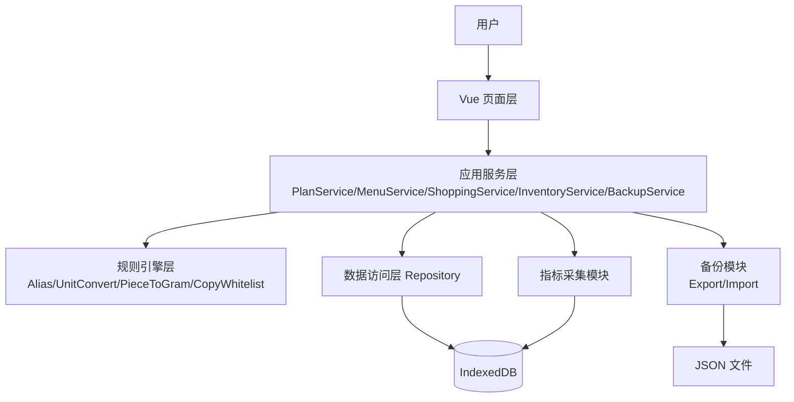
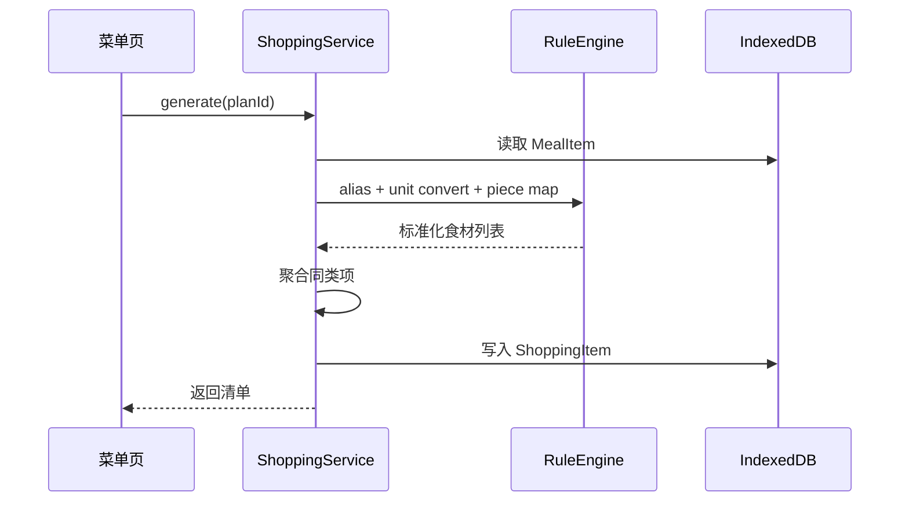
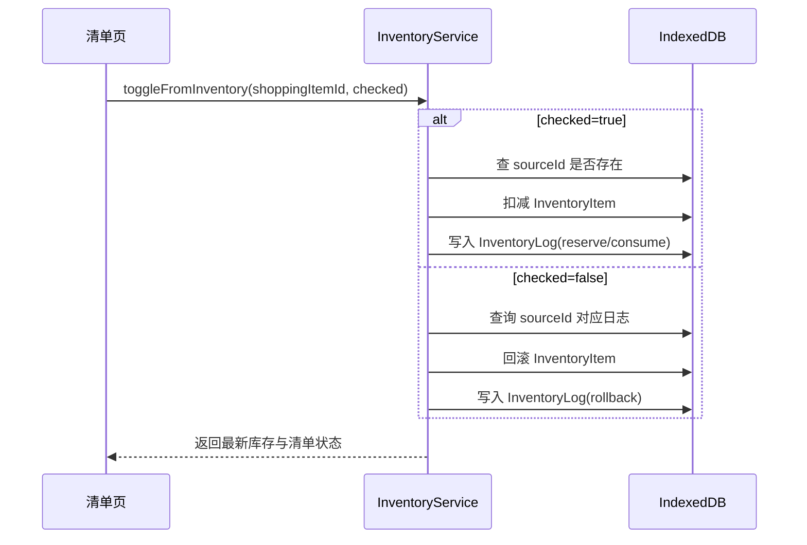

# 每周备菜助手 技术方案与架构文档（v1）

## 1. 文档目标

- 面向 `demo.md v0.2` 与 `bugFix.md v1`，给出可直接开工的工程方案。
- 约束：2 周开发可交付、4 周可稳定验证、单用户优先、移动端优先。
- 原则：数据正确性优先（可追踪、可回滚、可恢复） > 交互体验 > 扩展性。

---

## 2. 技术选型建议

## 2.1 前端
- `Vue 3` + `JavaScript` + `Vite`
- 状态管理：`Pinia`
- 路由：`Vue Router`
- UI：`Vant`（移动端组件）+ 少量自定义样式
- 本地存储：`IndexedDB`（通过 `Dexie` 封装）
- 表单校验：`zod`（或 `yup`）

## 2.2 后端（建议两阶段）
- 阶段 A（最快落地）：纯前端本地模式（IndexedDB + JSON 导入导出）
- 阶段 B（可选）：轻量 API（Node.js + Fastify + JavaScript + SQLite/PostgreSQL）
- 推荐：先做阶段 A，通过 4 周验证后再决定是否做阶段 B
- 选型结论：后端统一采用 `Fastify + JavaScript`，暂不引入 `NestJS`

## 2.3 工程与质量
- 包管理：`pnpm`
- 代码规范：`ESLint` + `Prettier`
- 单测：`Vitest`
- E2E：`Playwright`（至少覆盖主链路 1 条）
- 后端接口测试：`Vitest` + `Fastify inject`

---

## 3. 总体架构模型



说明：
- 页面只处理展示与交互，不直接写数据库。
- 业务规则统一放在服务层 + 规则层，避免逻辑散落在页面组件。
- 所有库存变更必须经过 `InventoryService`，保证日志与库存一致。

---

## 4. 分层设计（前端单体）

建议目录：

```txt
src/
  app/
    router/
    store/
  modules/
    plan/
      pages/
      components/
      service/
      repository/
      types.ts
    menu/
    shopping/
    inventory/
    review/
    backup/
  shared/
    rules/
      ingredientAliasMap.ts
      unitConvertMap.ts
      pieceToGramMap.ts
    utils/
      date.ts
      number.ts
      id.ts
  infra/
    db/
      dexie.ts
      tables.ts
```

---

## 5. 核心数据模型（实现口径）

## 5.1 Plan
- `id`
- `weekStartDate`
- `peopleCount`
- `days`
- `budget`
- `preferenceTags[]`
- `status`（`draft`/`active`/`done`）

## 5.2 MealItem
- `id`
- `planId`
- `date`
- `mealType`（`lunch`/`dinner`）
- `dishName`
- `servings`
- `durationMinutes`
- `difficulty`（`easy`/`medium`）
- `keyIngredients[]`
- `steps[]`

## 5.3 ShoppingItem
- `id`
- `planId`
- `category`
- `ingredientName`
- `ingredientNameNormalized`
- `quantity`
- `unit`
- `baseQuantity`
- `baseUnit`（`g`/`ml`）
- `purchaseStatus`（`pending`/`purchased`/`from_inventory`）
- `isFromInventory`
- `isPurchased`
- `sourceType`（`auto`/`manual`）
- `note`

## 5.4 InventoryItem
- `id`
- `ingredientNameNormalized`
- `quantity`
- `unit`（`g`/`ml`）
- `updatedAt`

## 5.5 InventoryLog
- `id`
- `ingredientNameNormalized`
- `changeType`（`reserve`/`consume`/`rollback`）
- `delta`
- `unit`
- `sourceType`（`shopping_item`/`manual`）
- `sourceId`
- `beforeQuantity`
- `afterQuantity`
- `createdAt`

## 5.6 WeeklyReview
- `id`
- `planId`
- `actualCost`
- `planningMinutes`
- `shoppingMinutes`
- `missedItemsCount`
- `wastedItemsCount`
- `completionRate`
- `note`

---

## 6. 关键规则引擎

## 6.1 食材归一与聚合
执行顺序固定：
1. `ingredientAliasMap` 别名归一  
2. `unitConvertMap` 单位换算  
3. `pieceToGramMap` 个转 g（首版 30 个，逐步补齐到 50）  
4. 按 `ingredientNameNormalized + baseUnit` 聚合

异常策略：
- 规则缺失时标记 `needsManualConfirm = true`，前端提示手动确认单位。

## 6.2 库存幂等与回滚
- 勾选“家里已有”：
  - 先检查 `sourceId` 是否已存在日志
  - 不存在则扣减库存并写 `InventoryLog`
- 取消勾选：
  - 查找对应 `sourceId` 的有效扣减日志
  - 生成反向 `rollback` 日志并恢复库存

## 6.3 购物项状态机（清单页）
- 状态定义：`pending`（待购买）/ `purchased`（已购买）/ `from_inventory`（冰箱已有）
- 互斥规则：同一购物项在任一时刻只能处于一个状态
- 切换规则：
  - `pending -> purchased`：写采购状态变更日志
  - `pending -> from_inventory`：触发库存扣减 + `InventoryLog`
  - `from_inventory -> pending`：触发库存回滚 + `InventoryLog(rollback)`
  - `purchased -> pending`：仅回退采购状态，不触发库存变更
- 兼容策略：`isFromInventory`、`isPurchased` 由 `purchaseStatus` 派生，避免双写不一致

## 6.4 复制白名单
复制：
- `peopleCount`、`days`、`budget`、`preferenceTags`
- 菜单结构字段

重置：
- `status` -> `draft`
- `isFromInventory`/`isPurchased` -> `false`
- `WeeklyReview` 新建空记录

---

## 7. 接口模型（阶段 B 可选）

> 阶段 A 为纯前端本地模式；以下接口用于后续服务化时无缝迁移。  
> 阶段 B 技术栈固定为：`Fastify + JavaScript`，数据库先 `SQLite`，需要多端同步时升级 `PostgreSQL`。

## 7.1 Plan
- `POST /plans` 创建周计划
- `GET /plans/:id` 获取周计划
- `POST /plans/:id/copy` 复制到新周（白名单规则）

## 7.2 Menu
- `POST /plans/:id/menu/generate` 基于模板生成菜单
- `PATCH /meal-items/:id` 替换或编辑菜单项

## 7.3 Shopping
- `POST /plans/:id/shopping/generate` 生成购物清单
- `POST /plans/:id/shopping-items` 新增手动购物项
- `PATCH /shopping-items/:id/purchase` 更新采购状态
- `PATCH /shopping-items/:id/inventory-toggle` 切换库存扣减
- `PATCH /shopping-items/:id/status` 按状态机切换（推荐统一入口）

## 7.4 Backup
- `GET /backup/export` 导出全量 JSON
- `POST /backup/import` 导入全量 JSON（先自动快照再覆盖）

---

## 8. 核心流程时序

## 8.1 生成购物清单


## 8.2 库存勾选/反勾选


---

## 9. 非功能与安全

## 9.1 数据安全
- 导入前自动快照（本地生成 `backup-YYYYMMDD-HHmmss.json`）。
- 导入时二次确认：明确提示“将覆盖当前全部数据”。
- 导入后写操作日志，支持问题排查。

## 9.2 性能目标（单用户）
- 首屏 < 2s
- 清单生成 < 500ms（50 菜谱模板以内）
- 导出/导入 < 3s（单用户数据量）

## 9.3 可用性
- 关键操作可撤销（至少库存勾选和菜单替换支持短时撤销）。
- 失败提示具体化（哪个食材映射缺失、哪条恢复失败）。

---

## 10. 测试策略（最低要求）

## 10.1 单元测试
- 食材归一与单位转换
- `pieceToGramMap` 缺失分支
- 库存幂等 + 回滚逻辑
- 购物项三态互斥与状态切换
- 周复制白名单与重置规则

## 10.2 集成测试
- 生成菜单 -> 生成清单 -> 勾选库存 -> 采购勾选 -> 复制下周
- 导出 -> 清空 -> 导入 -> 数据一致性校验
- API 模式下增加：`前端请求 -> Fastify 路由 -> Service -> Repository -> DB` 全链路验证

## 10.3 验收测试
- 对齐 `demo.md` 第 9 节全部验收标准逐项打勾

---

## 10.4 后端测试补充（Fastify + JavaScript）
- 路由层：参数校验、错误码、异常消息一致性
- 服务层：规则引擎调用顺序、库存幂等、回滚正确性
- 数据层：事务边界、失败回滚、导入覆盖前快照
- 契约测试：以 `Plan/Menu/Shopping/Backup` 四组接口作为固定契约，保障前后端联调稳定

---

## 11. 2 周实施建议（技术视角）

### Week 1
- D1：项目初始化（Vue3 + JavaScript + Pinia + Dexie）
- D2：数据表与 Repository
- D3：计划创建 + 菜单页骨架
- D4：模板库（先 30 道）+ 手动替换
- D5：规则引擎（alias/unit/piece）与单测
- D6：购物清单聚合 + 幂等校验
- D7：联调与缺陷修复

### Week 2
- D1：库存服务（日志、回滚、异常提示）
- D2：采购状态与复盘页
- D3：复制下周（白名单 + 状态重置）
- D4：JSON 导出/导入（全量覆盖 + 自动快照）
- D5：E2E 主链路 + 验收用例
- D6-D7：真实跑一周 + 文案和交互打磨

---

## 12. 架构演进路线（4 周后再决策）

- 若 4 周验证通过：将 Repository 层替换为 API 适配器，前端业务层不变。
- 新增后端后优先上云的模块：账号体系、云备份、多设备同步。
- 保持规则引擎独立模块，避免未来拆分时重写核心逻辑。
- 后端演进顺序：持续采用 `Fastify + JavaScript`，按业务复杂度补充 Schema 约束与测试深度；暂不引入 TypeScript。

---

## 13. 前端开发者承担全栈的实施口径（本项目）

- 角色策略：1 名前端主导，按“先业务闭环、后服务拆分”推进，避免过早后端化导致延期
- 开发顺序：先完成本地可用版本（阶段 A），再把 `Repository` 替换为 Fastify API 适配器（阶段 B）
- 后端边界：仅实现业务 API、数据持久化、日志与错误治理，不在首期引入复杂微服务能力
- 联调约束：前端页面禁止直接访问数据库，只通过服务层/接口层，保证未来迁移成本可控
- 质量门槛：每个迭代至少包含 1 条 E2E 主链路 + 关键规则单测 + Fastify 接口测试
